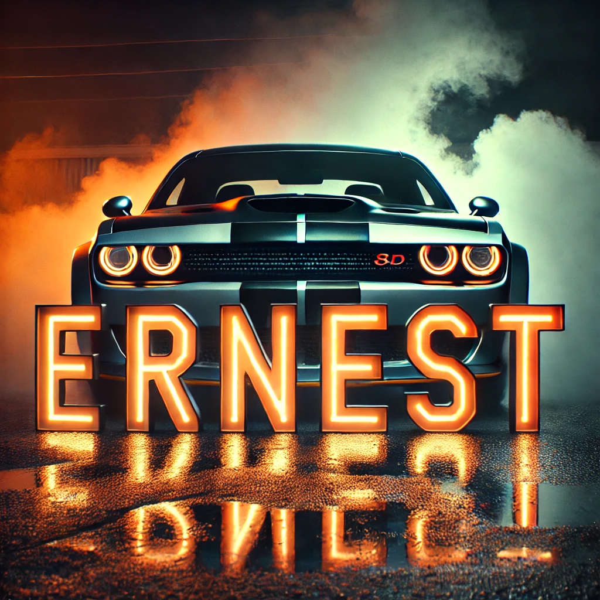

# ErnestV2
   

 
<u>⚡ A simple WhatsApp User Bot Coded By Pease Ernest ⚡</u>

       

  

 

&nbsp;&nbsp;

#

## Ernest V2 Deployment Methods
---
1.  **Fork Repo First, [CLICK HERE](git@github.com:PeaseErnest12287/Ernest-V2.git/fork) (A MUST) and Star ⭐ Repository for Courage.**
2.  **Get SESSION ID BY [PAIRING CODE](https://rola-v1-sesiongenerator.onrender.com)** 
3. **Deploy on [RENDER](https://dashboard.render.com/signup)**
4. **Deploy on [KATBUMP PANEL(DISCORD)](https://dashboard.katabump.com) **
8. **You can visit Bot whatsapp channel [BY CLICKING HERE](https://whatsapp.com/channel/0029VayK4ty7DAWr0jeCZx0i) for more**
9. **You can visit Bot whatsapp Group [BY CLICKING HERE](https://chat.whatsapp.com/FAJjIZY3a09Ck73ydqMs4E) for more**
<!-- 9. **All Tutorials [Here](https://www.youtube.com/@DavidCyril_TECH)** -->

## `Connect With Me`

   

<a href="https://wa.me/254793859108">
<a href="https://whatsapp.com/channel/0029VayK4ty7DAWr0jeCZx0i">
<a href="https://www.youtube.com/@ErnestTechHouse-y2l"> 

 

##
- *Ernest-V2 is not made by WhatsApp Inc. Sometimes or misusing the bot might ban your WhatsApp account!*
- *In that case, I'm not responsible for banning your account.*
- *Use Ernest-V2 at your own risk by keeping this warning in mind.*
  
#### `TOTAL PROFILE VIEWS 🧚`

⚙️ **Ernest-V2 is still under active development!**  
Lightweight, clean, and crafted with purpose — this bot is built for performance and personality.  
While it’s fully usable, more powerful features are being cooked up in the lab. Expect updates, enhancements, and new tricks as time goes.  
Stay strapped, stay curious — this is just the beginning.

# ErnestV2 

